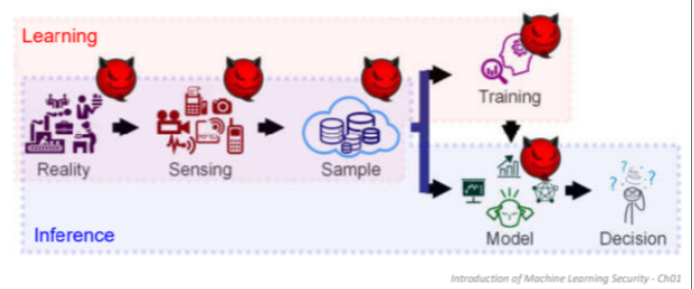
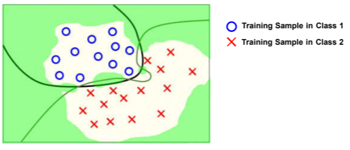

# Machine Learning Security Note-1

---

## 1. 关于Adversary攻击的一些概念理解

这里说的adversary指的是对手的攻击操作，它可能存在于我们机器学习模型的learning以及inference的各个阶段  ，这里拿下面的上课讲解图理解举例：

攻击可能存在于学习过程中的<mark>数据收集阶段</mark>，<mark>训练过程阶段</mark>，以及<mark>推理阶段通过对抗样本</mark>所导致模型的错误分类/表现而产生的攻击

## 2. ML存在的弱点以及对抗攻击的存在性

- 传统的ML通常关注于最大化performance，而对于security通常有所忽略

- 通常ML的假设是样本i.i.d.分布且100%相信样本，不考虑分布变化的情况且相信样本同模型相互独立，而这些都会成为<mark>对抗攻击的着入点</mark>

- ML存在uncertain situations，即通常我们的样本域有限但是整体域是无限的，无法完全做到覆盖
  
  

   
    
   
Uncertain Situations

  

## 3. Adversary Attack的分类

1. **Evasion Attack 逃逸攻击**：在推理阶段进行，主要针对特征进行操作（Misleading trained models）

2. **Poisoning Attack 毒化攻击**：在模型训练的阶段进行，有时候也可能针对推理阶段进行操作，主要针对特征/标签/模型进行操作

## 4.关于ML的一些基本概念（略，可以去看slide，同时也是复习的重点吧）
