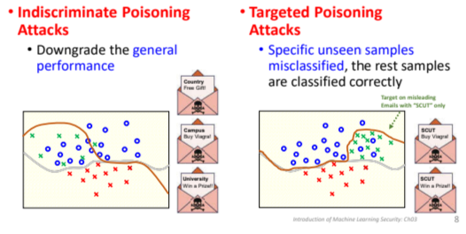
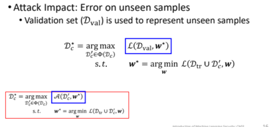
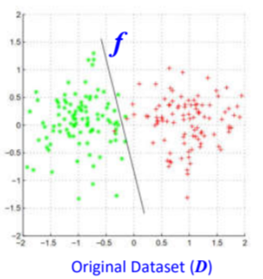
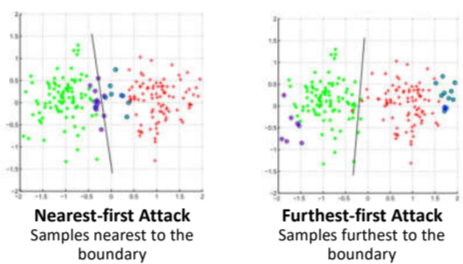
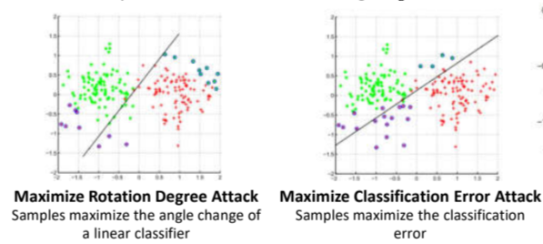
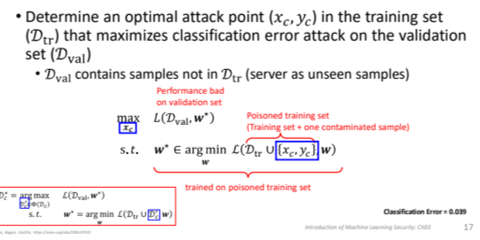
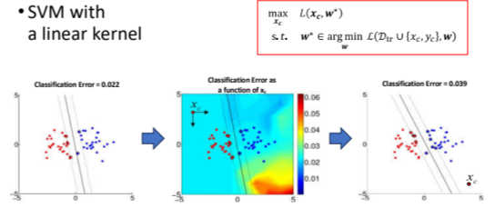
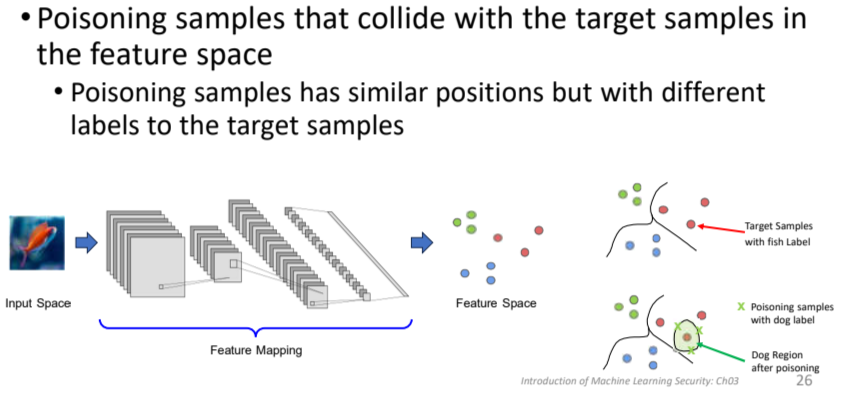
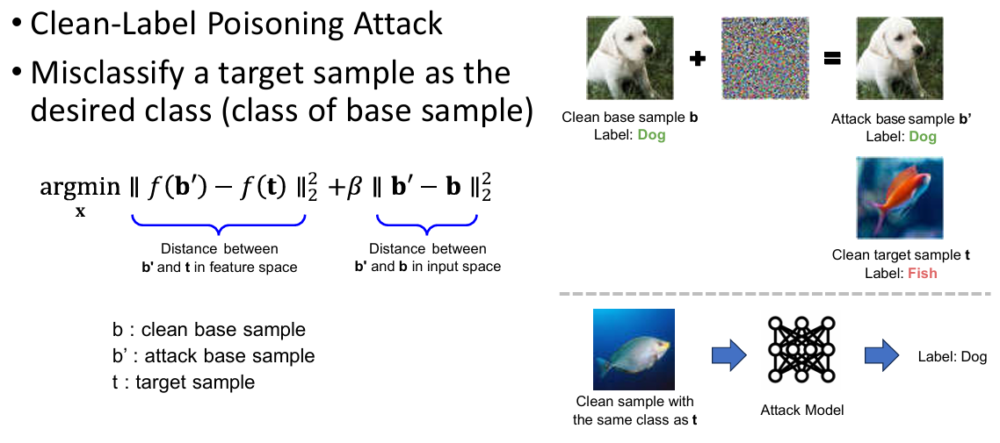

# Machine Learning Security Note3_Poisoning Attack

## 1. Recall...

回忆先前介绍毒化攻击的时候，我们说毒化主要是针对模型的训练，在learning阶段对其进行影响，使得其学习到错误的信息进而表现错误，在训练的阶段我们通常可以影响以下几点：

- Training Set Data Collection：可以通过污染我们的数据集，来实现对于模型表现的影响，注意到这里应该有两重限制（污染sample的数量、能够被修改的特征/标签的数量）

- Model Training：对于adversaries更为容易，因为训练过程被控制了

## 2. Poisoning Attack的目标

主要可以分为Indiscriminate以及targeted

- Indiscriminate: 目标是降低模型的整体表现性能（downgrade the general performance）

- Targeted: 目标是使得模型针对特定的unseen sample进行错误分类，其他的samples都能够正常被正确分类
  
  

## 3. Poisoning Attack公式

$D_C^* = \arg \max_{D_C' \in \Phi(D_C)} \mathcal{A}(D_C', w^*)$

$s.t.   w^* = \arg \min_w \mathcal{L}(D_{tr} \cup D_C', w)$

目标是创建一个被污染过的数据集$D_C^*$来训练模型$w$,使得攻击的影响$\mathcal{A}$最大化

## 4. Indiscriminate Attack

该攻击主要介绍了以下几类：label flip attack / one attack / Sponge Attack

总体公式：

注意这里的impact函数A已经被换成了在新验证集$D{val}$下的损失函数，由于是indiscriminate，我们的目标是尽量降低模型的表现，所以是最大化其损失函数

### (1) Label Flip Attack

感觉最为简单粗暴的一个，对于一个在数据集D上训练好的分类器f，我们要做的是操作改变D（改变攻击样本的标签）使得分类器f改变

- Nearest-first:操作离分类边界最近的样本使其label反转使得分类器变化

- Furthest-first:操作离分类边界最远的样本标签反转使得分类器变化

- Maximize Rotation Degree:操作样本使得线性分类器的偏转角度最大（**关键**：需计算样本对权重向量的梯度，选择能最大程度改变分类器角度的样本，例如在svm中）

- Maximize Classification Error Attack:操作样本使得分类误差最大（通常需要进行迭代优化）

该攻击方法存在的问题：极易被发现，并且可能需要大量攻击样本

### (3) One Attack

特点：仅通过一个选定的特定样本$(x_{c},y_{c})$进行攻击，使得原模型在选定验证集$D_{val}$上的损失函数最大，这种情况在具有linear kernel的SVM中能通过梯度以及选择来实现

## 5. Targeted Attack

目标：使得特定样本被误分类到另一个特定的类别中并且不会降低模型的其他精确度表现

公式：

$$
D_c^{*} = \arg \max_{D_c^{'} \in \Phi(D_c)} -\mathcal{L}(D'_{val}, \mathbf{w}^*)
$$

$$
s.t.  \ \ \ \ w^*=argmin_{w} \mathcal{L}(D_{tr}\cup D_{c}^{'},w)
$$

即使得我们的模型在包含desired label的数据集中在目标攻击样本上表现最好（loss最低），即让针对这一攻击样本，模型越能将其错误识别为另一个disired label越好

- Feature Collision
  
  毒化样本，使得其在被映射到特征空间以后和我们的目标样本距离更近
  
  

Clean-Label Poisoning Attack (干净标签毒化攻击)：使得一个目标样本被误分类为base sample基准样本

理解：同时优化缩小特征空间中攻击样本同目标样本的距离，以及缩小输入空间中攻击样本与干净基准样本间的距离（多目标优化这种感觉？）

## 6. Backdoor Attack 后门攻击

